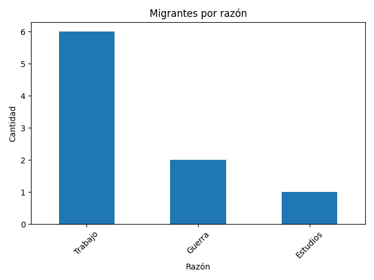
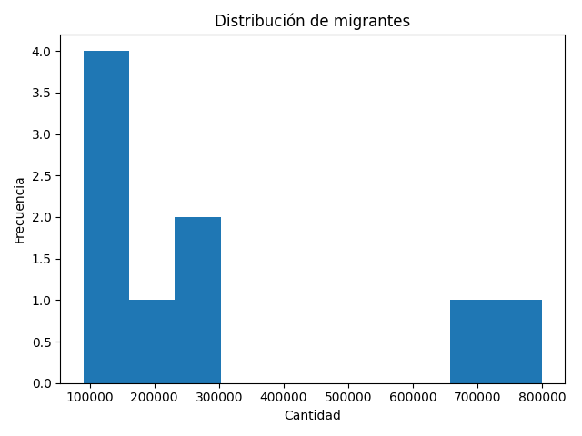
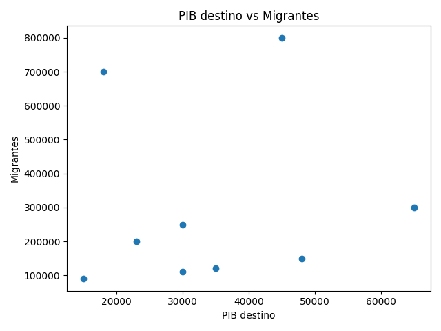
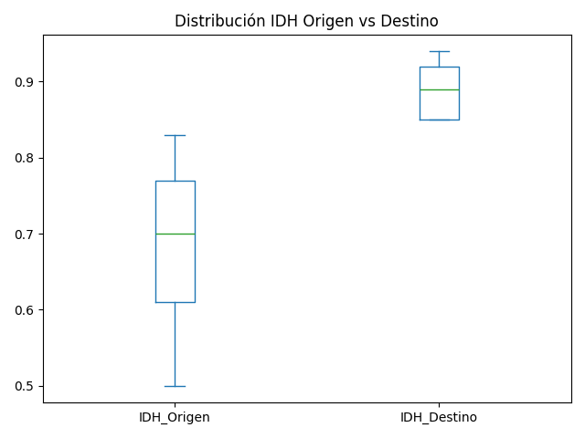

# 📊 Análisis de Migración

## 🧠 Contexto
La migración es un fenómeno complejo influenciado por factores económicos, sociales y políticos.
Este proyecto analiza un dataset de migración con el objetivo de identificar patrones clave y generar insights accionables.

---

## 🎯 Objetivo
- Analizar las principales razones de migración
- Identificar tendencias relevantes
- Generar visualizaciones para facilitar la interpretación de datos
- Construir un pipeline reproducible de análisis de datos

---

## 📂 Dataset
- Fuente: Datos de migración (archivo .csv)
- Contiene información sobre:
  - País de origen
  - Razón de migración
  - Variables demográficas

---

## ⚙️ Metodología
El proyecto sigue un pipeline estructurado:

- Limpieza de datos
  - Eliminación de nulos
  - Estandarización de categorías
- Análisis exploratorio
  - Distribuciones
  - Frecuencias
- Visualización
  - Gráficos para identificar patrones

---

## 📊 Insights clave

- La mayoría de migraciones se concentran por razones económicas
- Existe relación positiva entre PIB destino y flujo migratorio
- El IDH del país destino suele ser mayor que el de origen

👉 Esto sugiere que los factores económicos dominan el fenómeno migratorio en el dataset analizado.

---
## 📈 Visualizaciones
### Distribución de migrantes

### Migrantes por razón de migración

### Relación entre PIB y migración

### Diferencias de IDH

---

## 🏗️ Estructura del proyecto
```bash
migracion-analisis/
│
├── data/
│   ├── raw/           # Datos originales
│   └── processed/     # Datos limpios
│
├── notebooks/         # Exploración y prototipos
│
├── src/
│   ├── limpieza.py    # Limpieza de datos
│   ├── analisis.py    # Análisis exploratorio
│   ├── visualizacion.py  # Generación de gráficos
│
├── images/            # Gráficos para README
│
├── main.py            # Pipeline principal
├── requirements.txt   # Dependencias
└── README.md
```
---

## ▶️ Cómo ejecutar
```bash
git clone https://github.com/IsaUrdaneta/migracion-analisis.git
cd migracion-analisis

python -m venv venv
source venv/Scripts/activate  # Windows

pip install -r requirements.txt
python main.py
```

---

## 🚀 Próximas mejoras
- Dashboard interactivo (Streamlit)
- Automatización del pipeline
- Análisis predictivo
- Integración con base de datos

---

## 👩‍💻 Autora
Isa Urdaneta/ Data Analyst