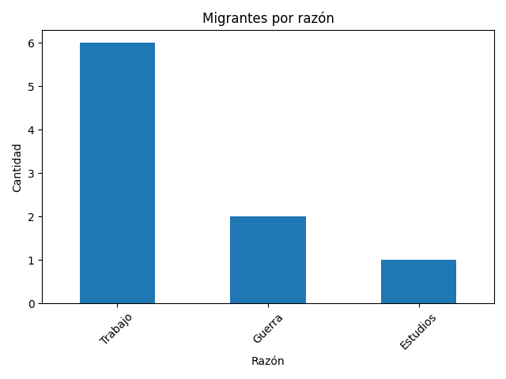
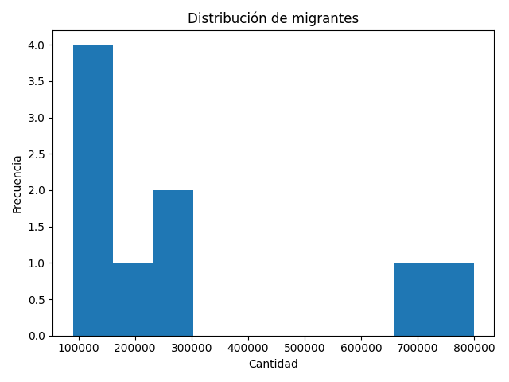
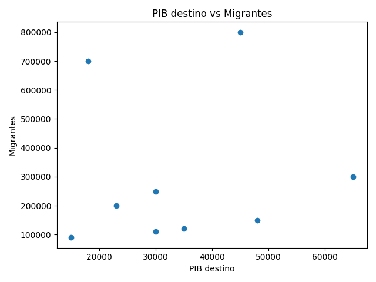
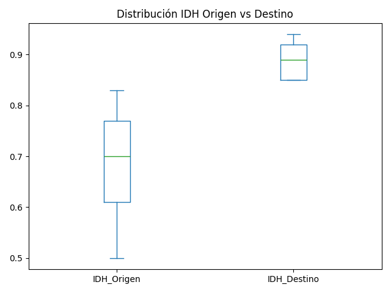

# 📊 Análisis de Migración — Data Pipeline & Insights

## 🧠 Contexto
La migración es un fenómeno multifactorial influenciado por variables económicas, sociales y de desarrollo humano.
Este proyecto analiza un dataset de migración internacional con el objetivo de identificar patrones estructurales y generar insights basados en datos.

---

## 🎯 Objetivo

- Identificar las principales razones de migración
- Analizar la relación entre variables económicas (PIB, IDH) y flujos migratorios
- Generar insights automáticos a partir de los datos
- Construir un pipeline reproducible y modular de análisis

---

## ⚙️ Enfoque del proyecto

El proyecto fue desarrollado como un pipeline de datos estructurado, separando responsabilidades en módulos independientes:

- Ingesta de datos
- Limpieza y validación
- Feature engineering
- Análisis exploratorio
- Generación de insights
- Visualización y exportación

---

## 🧠 Arquitectura y decisiones técnicas

El diseño del proyecto sigue principios de modularidad y desacoplamiento:

- analisis.py → lógica de negocio y métricas
- visualizacion.py → generación de gráficos
- main.py → orquestación del pipeline

### 🔧 Mejora clave: desacoplamiento de rutas

Las funciones de visualización fueron diseñadas para no depender de rutas fijas:

def grafico_migrantes_por_razon(df, output_dir):

Esto permite:

- reutilizar funciones en distintos entornos
- facilitar testing
- integrar fácilmente con dashboards (Streamlit)

---

## 📂 Dataset
- Fuente: Datos de migración (archivo .csv)
- Contiene información sobre:
  - País de origen
  - Razón de migración
  - Variables demográficas

---

## ⚙️ Flujo del pipeline
1. Carga de datos (data/raw)
2. Limpieza y estandarización
3. Feature engineering (cálculo de diferencia de IDH)
4. Análisis estadístico
5. Generación automática de insights
6. Exportación de resultados y visualizaciones

Ejecutar:

python main.py

---

## 📊 Outputs generados

El pipeline produce automáticamente:

- Dataset limpio → data/processed/migracion_limpio.csv
- Métricas → estadisticas.txt
- Aggregaciones → migrantes_por_razon.csv
- Insights → insights.txt
- Visualizaciones → carpeta images/graficos/

Ejemplo de insights:

```txt
- El 65% de las migraciones son por razones económicas.
- USA, España y Chile concentran el mayor flujo migratorio.
- Existe correlación positiva entre PIB destino y migración.
```

---

## 🧠 Insights principales
- La principal razón de migración corresponde a factores económicos
- Las tres principales razones concentran la mayoría de los casos
- Existe una relación entre el PIB del país destino y el flujo migratorio
- Los migrantes tienden a desplazarse hacia países con mayor IDH

Los insights son generados automáticamente a partir de los datos, permitiendo escalabilidad del análisis.

---

## 📈 Visualizaciones
### Distribución de migrantes

### Migrantes por razón de migración

### Relación entre PIB y migración

### Diferencias de IDH


---

## 🏗️ Estructura del proyecto
```bash
migracion-analisis/
│
├── data/
│ ├── raw/              # Datos originales
│ └── processed/        # Datos limpios
│
├── src/
│ ├── limpieza.py       # Limpieza de datos
│ ├── analisis.py       # Análisis exploratorio
│ └── visualizacion.py  # Generación de gráficos
│
├── images/             # Gráficos para README
│ └── graficos/
│ ├── grafico1.png
│ ├── grafico2.png
│ ├── grafico3.png
│ └── grafico4.png
│
├── main.py             # Pipeline principal
├── requirements.txt    # Dependencias
└── README.md
```
---

## ▶️ Cómo ejecutar
```bash
git clone https://github.com/IsaUrdaneta/migracion-analisis.git
cd migracion-analisis

python -m venv venv
source venv/Scripts/activate  # Windows

pip install -r requirements.txt
python main.py
```

---

## 🚀 Próximas mejoras
- Dashboard interactivo (Streamlit)
- Automatización del pipeline
- Análisis predictivo
- Integración con base de datos

---

## 👩‍💻 Autora
Isanevys Urdaneta

Data Analyst | Data Science